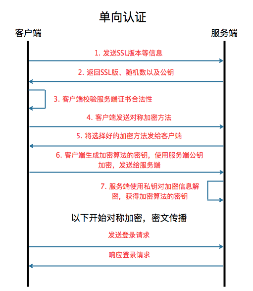

# Netty-Small-Demo
```
@author 鲁伟林
子项目Netty-Small-Demo介绍诸多使用Netty的小案例。如: ChannelHandler动态编排、AttributeMap的使用或ChannelPrimise等诸多Netty提供的特性。
非常欢迎同学们fork或者留言，一起交流技术。
本博客中涉及的完整代码：
GitHub地址: https://github.com/thinkingfioa/netty-learning/tree/master/netty-small-demo。
本人博客地址: https://blog.csdn.net/thinking_fioa
```

## 1. 项目的案例介绍
Netty-Samll-Demo子项目，基于Netty的多个特性，实现多种案例。介绍如下:

|案例|作用|
|:---:|:---:|
|UDP传输|实现Netty的UDP传输机制|
|ChannelHandler动态编排|根据实际业务场景，动态编排ChannelHandler|
|AttributeMap使用|利用ChannelAttributeMap，实现多个ChannelHandler传递变量|
|Netty与多种编码器的使用|基于Netty和多种编码节技术，实现自定义协议开发|
|ChannelGroup使用|Netty的ChannelGroup管理Channel|
|channel.writeAndFlush与ctx.writeAndFlush区别|案例分析两者不同点|

## 2. UDP传输

## 3. ChannelHandler动态编排
Netty提供用户事件触发: userEventTriggered特性，实现ChannelHandler动态编排。案例代码Package: package org.lwl.netty.dynamic。如果想阅读源码，建议下载源码，导入idea中阅读。阅读过程中，欢迎交流

1. 项目源码: [地址](https://github.com/thinkingfioa/netty-learning/tree/master/netty-small-demo/src/main/java/org/lwl/netty/dynamic)
2. 项目包名: org.lwl.netty.dynamic
3. 项目Main类: DynamicDemoStart

### 3.1 场景
实际项目开发中，客户端存在这样两个问题:

1. 创建Channel对象时，无法明确的知道需要添加到ChannelPipeline链上的具体ChannelHandler有哪些？具体ChannelHandler往往是运行时才能知道。
2. 一次性将所有的ChannelHandler添加到ChannelPipeline链上往往与设计不符。比如：用户先完成认证延签后，采用发起用户登录。用户完成登录，才能发起消息类型订阅。

### 3.2 项目介绍
ChannelHandler动态编排项目，主要讲解了如何通过userEventTriggered特性，来实现动态向ChannelPipeline加入ChannelHandler。项目主要模拟https单向认证的过程，Server端一次性添加所有的ChannelHandler到ChannelPipeline上，Client端分下列步骤加入ChannelHandler

1. 发送Client端SSL版本等信息。  ----- SslHandler
2. 发送Client端支持的对称加密方案。  ----- SymEncryptionHandler
3. 产生随机码作为对称加密密钥，使用服务端的公钥对随机码加密，发送给服务端。 ----- RandomCodeHandler
4. 发送加密后登录消息消息。 ----- LoginHandler
5. 登录成功后加入心跳Handler ----- HeartbeatClientHandler

### 3.3 https单向认证序列图


### 3.4 项目讲解
1. ChannelHandler动态编排中使用较为简单的编解码器，如果想深入学习Netty多种编解码方式，请看[netty-private-protocol子项目](https://github.com/thinkingfioa/netty-learning/tree/master/netty-private-protocol)。
2. 消息采用简单的消息格式。项目主要想表明如果实现ChannelHandler动态编排机制，https单项认证部分只是一个简单的框架，点到为止。
3. 

### 3.4 运行结果图

## 4. ctx.write(...)和channel.write(...)区别案例说明

## TODO LIST

-  UDP传输
-  ChannelHandler动态编排
-  AttributeMap使用
-  Netty与protobuf的使用
-  ChannelGroup使用
-  文件传输性能对比
-  dom4j
-  channel.writeAndFlush与ctx.writeAndFlush区别

# 参考:
1. [Https单向认证和双向认证](https://blog.csdn.net/duanbokan/article/details/50847612)